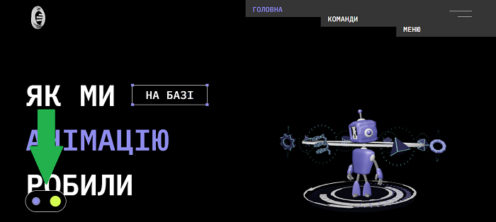
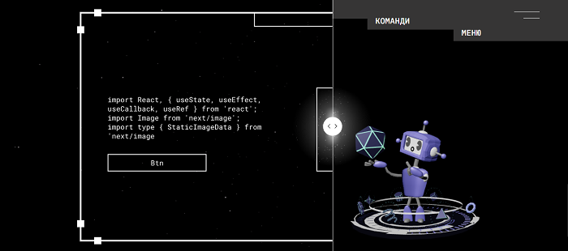
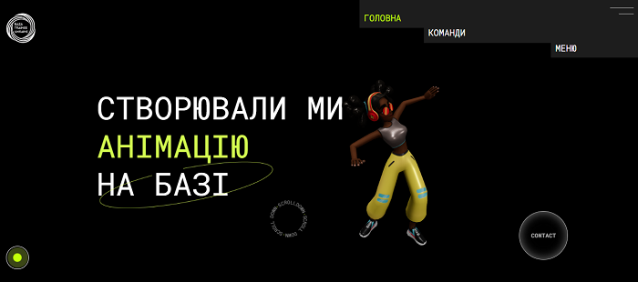

## Overview

This project was created as part of the **Baza Trainee Ukraine** initiative ([baza-trainee.tech](https://baza-trainee.tech/uk)), an organization that helps aspiring developers take their first professional steps in IT by working on real social and internal projects.

The website is an **animated representation** of the organization's activities. Its primary goal is to showcase Baza Trainee's mission through visually engaging and interactive elements while providing the project team with hands-on experience in animation and modern web technologies.

This project has become a significant milestone for the team, allowing participants to deepen their knowledge of animated interfaces, explore new tools, and contribute to the growth of a community for aspiring developers.

[Visit the live website](https://baza-everything-can-move.vercel.app/)

## Team

Meet the talented team behind this project:

- [**Olha Ivanova**](https://www.linkedin.com/in/ivolga-kyiv/) — Baza Trainee Ukraine
- [**Svitlana Kiriyaka**](https://www.linkedin.com/in/svitlana-kiriyaka/en?originalSubdomain=ua) — UX/UI Designer
- [**Olga Nazarenko**](https://www.linkedin.com/in/olya7715/?lipi=urn%3Ali%3Apage%3Ad_flagship3_people_connections%3BiYEui%2BDxR5uIAYrYY81gwA%3D%3D) — UX/UI Designer
- [**Vitaly Prytula**](https://www.linkedin.com/in/vitaliiprytula/) — Frontend Developer / Team Lead
- [**Serhii Oberemchuk**](https://www.linkedin.com/in/serhii-oberemchuk/) — Full Stack Developer
- [**Ganna Kovchyk**](https://www.linkedin.com/in/ganna-kovchyk) — Frontend / Full Stack Developer
- [**Viktoria Vonsovych**](https://www.linkedin.com/in/viktoria-v-5a0634129/) — Frontend / React / Next.js
- [**Bohdana Lutska**](https://www.linkedin.com/in/bohdana-lutska-28b497244/) — Frontend Developer
- [**Valerii Hrekov**](https://www.linkedin.com/in/valerii-hrekov-b232381a0/) — 3D Artist / Modelling

## Features

The project stands out for its highly **animated** and **interactive** user experience, making every element of the website visually engaging — even the **404 page** is uniquely designed with animations.

### Key Features:

- **Dual Design Modes**:  
  Upon loading the website, one of two completely different designs is selected at random — a **blue theme** or a **green theme**. Users can easily switch between these designs using a dedicated button, offering a dynamic and customizable experience.
- **Smooth Animations**:  
  Every page and component features seamless animations to enhance interactivity and visual appeal.
- **Interactive Elements**:  
  Various elements across the site respond to user interactions, creating an immersive browsing experience.

### Screenshots:

## Technologies

The project utilizes modern tools and libraries to create a visually rich and interactive experience. Below are the key technologies and frameworks used:

- **React** ([Website](https://reactjs.org/)) — A JavaScript library for building user interfaces.
- **Next.js** ([Website](https://nextjs.org/)) — A React framework for server-side rendering and static site generation.
- **TypeScript** ([Website](https://www.typescriptlang.org/)) — A strongly typed programming language that builds on JavaScript.
- **tailwindcss** ([Website](https://tailwindcss.com/)) — A utility-first CSS framework for designing responsive layouts.
- **Framer Motion** ([Website](https://www.framer.com/motion/)) — A library for declarative animations and gestures in React.
- **Three.js** ([Website](https://threejs.org/)) — A 3D library for WebGL rendering.
- **@react-three/fiber** ([Website](https://docs.pmnd.rs/react-three-fiber/getting-started/introduction)) — A React renderer for three.js to work with 3D scenes.
- **@react-three/drei** ([Website](https://docs.pmnd.rs/drei/introduction)) — Utilities and helpers for react-three-fiber.
- **GSAP** ([Website](https://greensock.com/gsap/)) — A powerful library for creating animations.
- **Zustand** ([Website](https://docs.pmnd.rs/zustand/getting-started/introduction)) — A state management library for React.

By combining these technologies, the project delivers a cutting-edge user experience with seamless animations, interactive elements, and a responsive design.

## Contact
